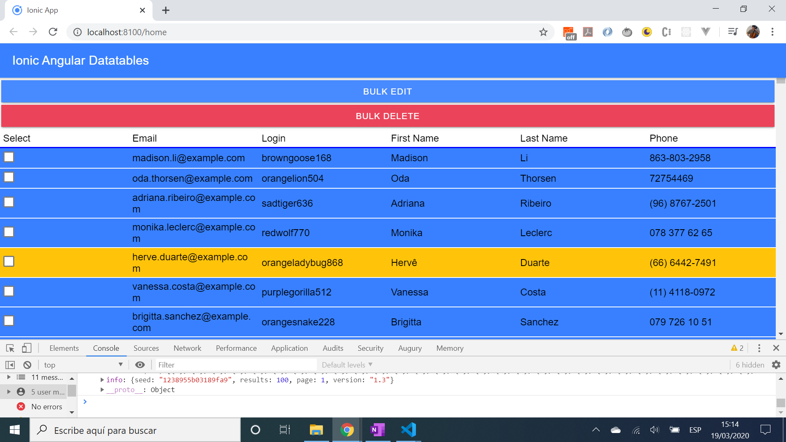
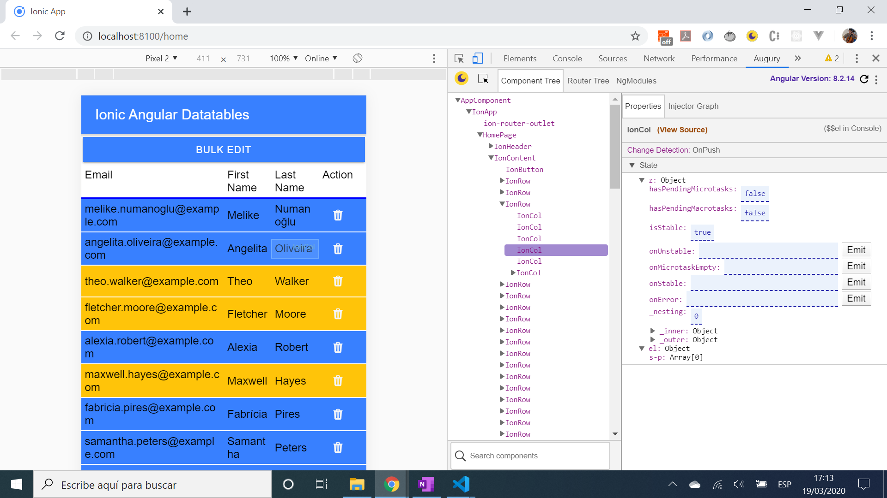

# :zap: Ionic Angular Datatables

* App to display a responsive table of data from an API, using the [Ionic 5 framework](https://ionicframework.com/docs) with Angular
* Code from [Simon Grimm](https://www.youtube.com/channel/UCZZPgUIorPao48a1tBYSDgg) - see [:clap: Inspiration](#clap-inspiration) below
* **Note:** to open web links in a new window use: _ctrl+click on link_


## :page_facing_up: Table of contents

* [:zap: Ionic Angular Datatables](#zap-ionic-angular-datatables)
  * [:page_facing_up: Table of contents](#page_facing_up-table-of-contents)
  * [:books: General info](#books-general-info)
  * [:camera: Screenshots](#camera-screenshots)
  * [:signal_strength: Technologies](#signal_strength-technologies)
  * [:floppy_disk: Setup](#floppy_disk-setup)
  * [:computer: Code Examples](#computer-code-examples)
  * [:cool: Features](#cool-features)
  * [:clipboard: Status & To-do list](#clipboard-status--to-do-list)
  * [:clap: Inspiration](#clap-inspiration)
  * [:envelope: Contact](#envelope-contact)

## :books: General info

* App gets data from a [random user details API](https://randomuser.me/) and displays it in a responsive table that, upon resizing, reduces the number of columns from 6 (PC screen) to 4 (mobile screen)

## :camera: Screenshots




## :signal_strength: Technologies

* [Ionic/angular v5](https://ionicframework.com/)
* [Ionic v5](https://ionicframework.com/)
* [Angular v12](https://angular.io/)

## :floppy_disk: Setup

* Load dependencies using `npm i`
* To start the server on _localhost://8100_ type: `ionic serve`

## :computer: Code Examples

* `bulkDelete()` method uses checkbox column result to remove rows checked

```typescript
  // take items checked - this.edit - and filter indexes and coerce into a number
  // remove rows with this index using the splice method
  bulkDelete() {
    console.log('this.edit: ', this.edit); // example: returns {0: true, 1: true, 2: true}
    const preDelete = Object.keys(this.edit);
    console.log('preDelete', preDelete) // example returns ["0", "1", "2"] - array of strings
    const deleteList = preDelete.filter(index => this.edit[index]).map(key => +key); // [0, 1, 2]
    while (deleteList.length) { // as long as deleteList is > 0
      this.data.splice(deleteList.pop(), 1) // splice each row[item], pop deleteList down each time
    }
    this.toggleBulkEdit(); // boolean switched to hide bulkEdit ion-button once complete
  }

```

## :cool: Features

* Sort function uses the [localeCompare()](https://developer.mozilla.org/en-US/docs/Web/JavaScript/Reference/Global_Objects/String/localeCompare) method to return a number indicating if a reference string comes before or after or is the same as the given string in sort order.
* `ion-select-option` used to provide drop-down rows per page options. Couldn't work out how to have a default selected value, e.g. 10, currently defaults to the full list until a rows per page option is chosen

## :clipboard: Status & To-do list

* Status: Working. Updated may 2021
* To-do: nothing

## :clap: Inspiration

* [Simon Grimm: Youtube video: Building a Responsive Data Table with Ionic Grid](https://www.youtube.com/watch?v=5xQlIYHgesg&t=5s).
* [Simon Grimms great Ionic site: Devdactic](https://devdactic.com/)

## :file_folder: License

* This project is licensed under the terms of the MIT license.

## :envelope: Contact

* Repo created by [ABateman](https://github.com/AndrewJBateman), email: gomezbateman@yahoo.com
